# Hands-On Infrastructure as code with Terraform

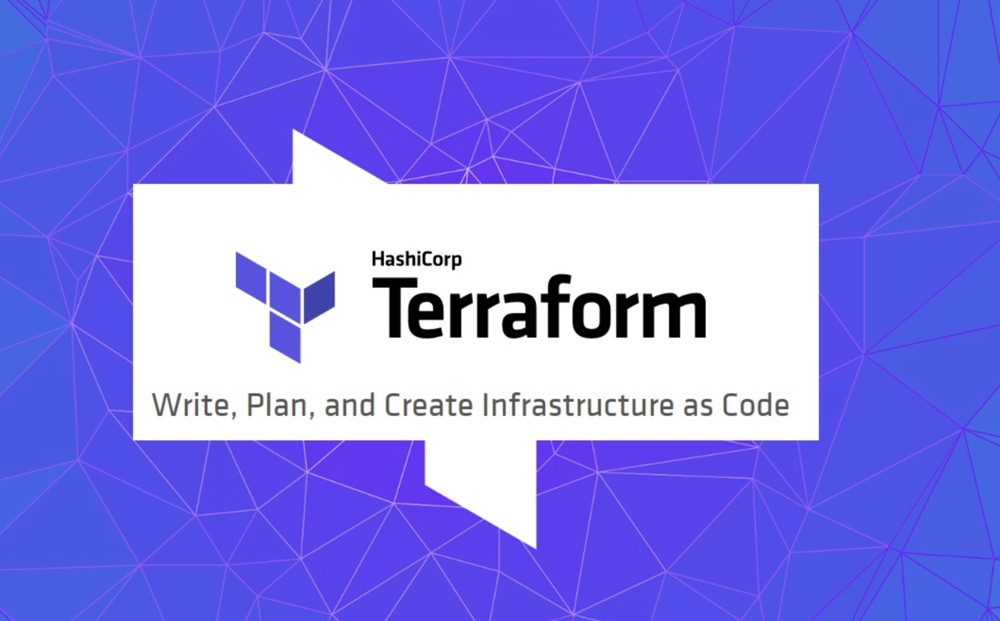

- [Overview](#overview)
- [Hands On](#hands-on)
    - [Pre-check](#pre-check)
        - [Check instance is running](#check-instance-is-running)
        - [Check terraform on instance](#check-terraform-on-instance)
    - [Using terraform](#using-terraform)
        - [Running a terraform plan & apply](#running-a-terraform-plan-and-apply)
        - [Updating outputs and running terraform refresh](#updating-outputs-and-running-terraform-refresh)
        - [Updating existing infrastructures with a tfvars file](#Updating-existing-infrastructures-with-a-tfvars-file)
        - [Updating existing infrastructures](#updating-existing-infrastructures)
        - [Taking down the terraform infrastructure](#taking-down-the-terraform-infrastructure)
- [Conclusion](#conclusion)
- [Terraform training](#terraform-training)
- [Resources](#resources)
- [Appendix](#appendix)
    - [Setting up the Playground Environment](#setting-up-the-playground-environment)
    - [Tearing down the Playground Environment](#tearing-down-the-playground-environment)

# Overview

The usage of cloud resources has grown considerably in recent years. Be it GCP, AWS or Azure, each has their own configurations and infrastructure setup. Rather than repeating the manual process of going through their various consoles and setting them up, Terraform provides an elegant solution as Infrastructure as code (IaC).

In this playground, we will show how to set up a basic Amazon resource with Terraform.

# Hands-on

## Pre-check

### Check instance is running

In a separate tab, navigate to http://\<IP\>:8080 and confirm the Theia console is up.
    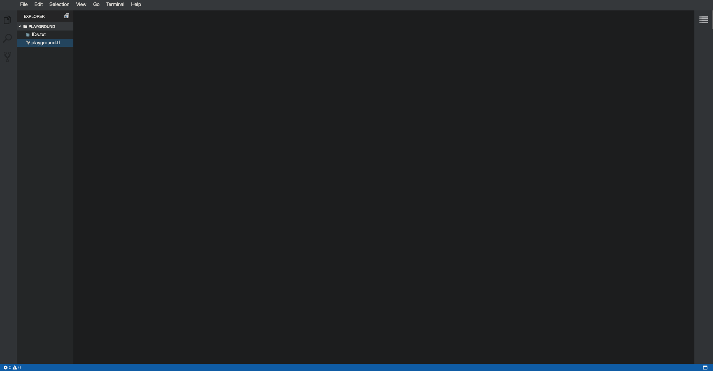

### Check terraform on instance

On the console, open a terminal and check the terraform version with the following command `terraform -v`
    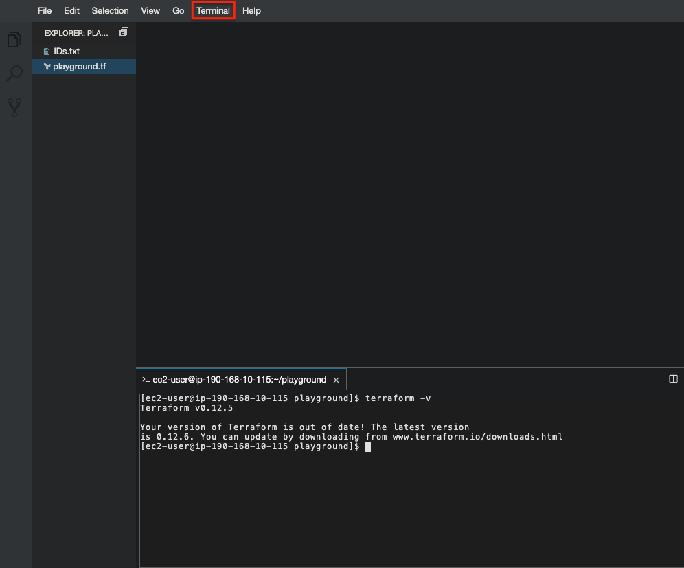

## Using terraform

* Please note that the working directory is /home/ec2-user/playground

### Running a terraform plan and apply

1. On the Theia Terminal, click the first symbol (explorer) on the left of the tool bar to bring up the list of files in the current workspace seen below.

    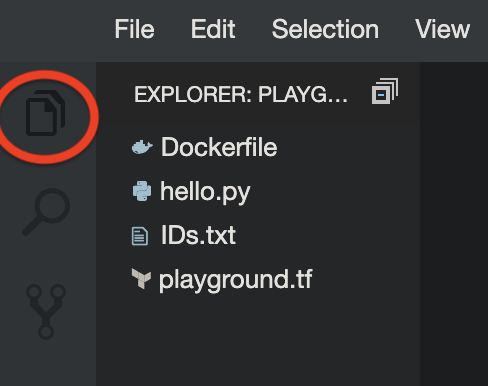

2. Open up a terminal and type terraform plan, which ought to throw the following error
    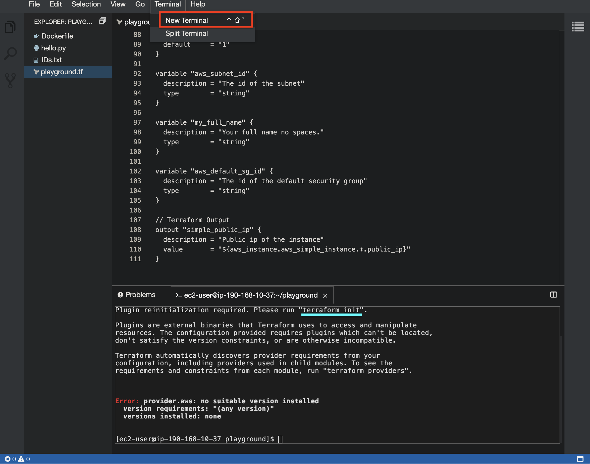
    * This is expected. For that matter, Terraform will provide the command that needs to be run to fix the error
3. Run `terraform init` and the CLI should return the following `Terraform has been successfully initialized`
    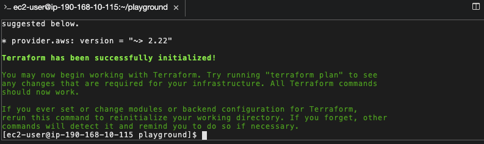

4. Run `terraform plan` again. When prompted, fill in the values requested by opening the IDs.txt file.
    * Note that for `var.my_full_name` please put in your name __WITHOUT__ whitespaces and special characters or it will throw an error.
    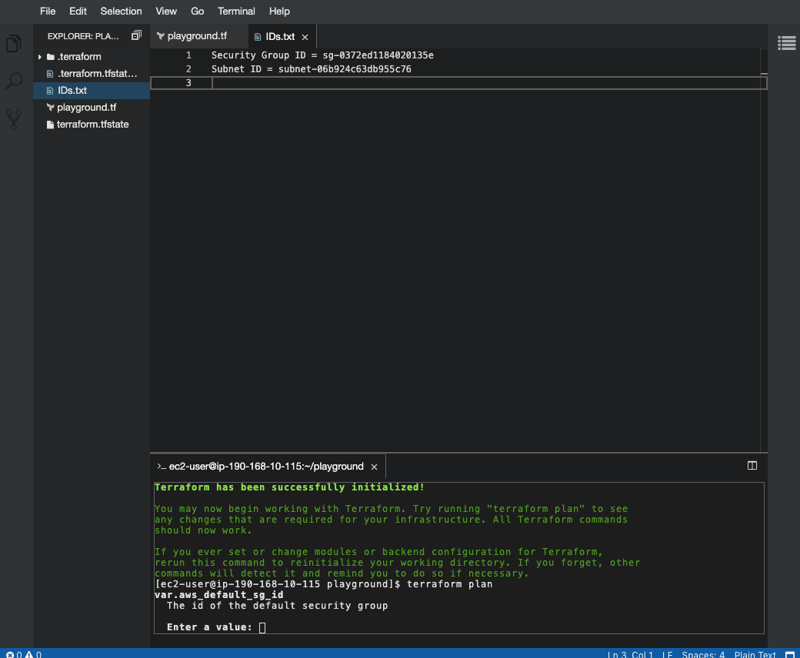

5. The output generated is a plan of what Terraform will generate.

6. Add default values for the variables `aws_subnet_id` and `aws_default_sg_id`; defined in `IDs.txt`. For the `my_full_name` variable, add your name without spaces or special characters
    ```
    variable "aws_subnet_id" {
        description = "The id of the subnet"
        type        = "string"
        default = "<IDs.txt value>"
    }

    variable "my_full_name" {
        description = "Your full name no spaces."
        type        = "string"
        default = "<your name>"
    }

        variable "aws_default_sg_id" {
        description = "The id of the default security group"
        type        = "string"
        default = "<IDs.txt value>"
    }
    ```

6. Run `terraform apply`, type yes when prompted.
    * Terraform will no longer prompt for user input for the variables.
    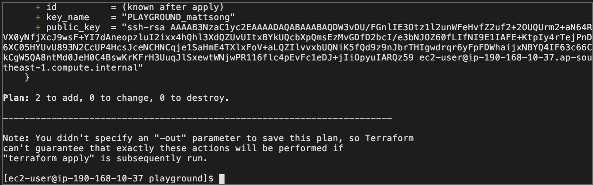

7. The CLI will return the output of the Terraform apply command defined in `playground.tf`.
    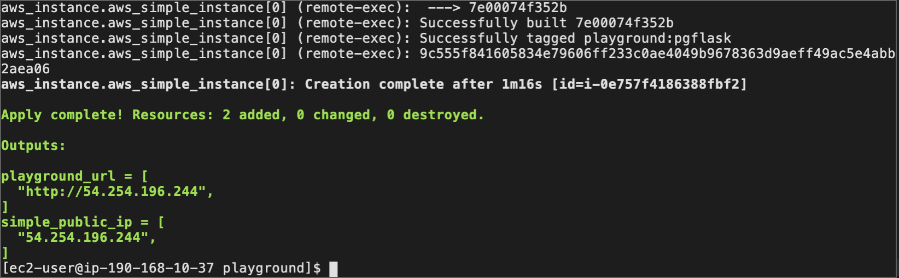

8. Pasting the IP address from the terraform output will present a webpage that says hello world.
    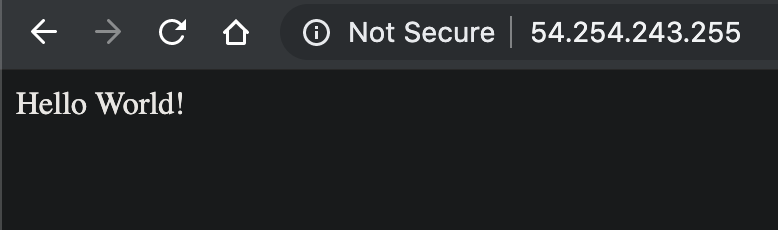

### Updating outputs and running terraform refresh 

1. To expose more values from the output, insert the following into the `playground.tf` file

    ```
    output "simple_instance_id" {
        description = "The id of the instance"
        value       = "${aws_instance.aws_simple_instance.*.id}"
    }
    ```
    Type `terraform fmt` to automatically format all .tf files for readability

    From:

    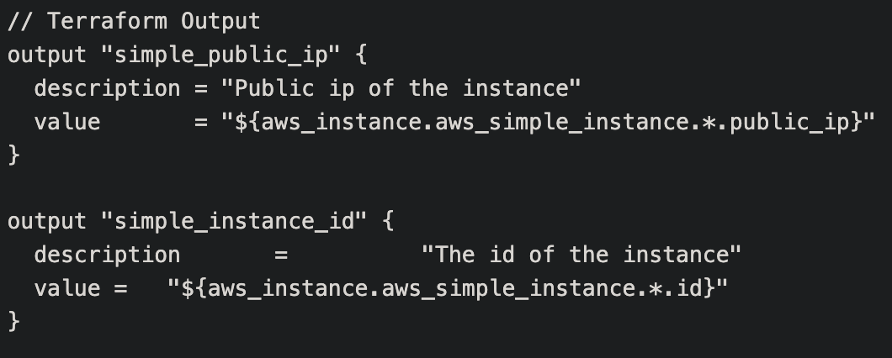

    To:

    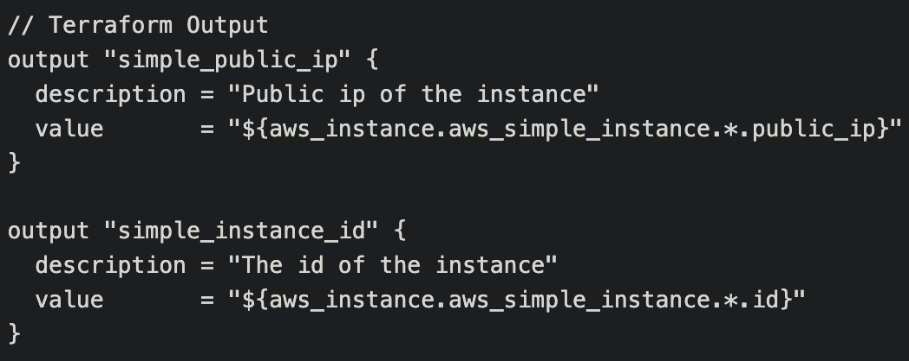

2. Typing `terraform output` will show the old output.

    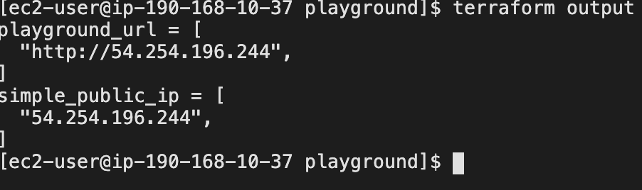

3. Type `terraform refresh`, filling in the values once again to get the new updated outputs.
    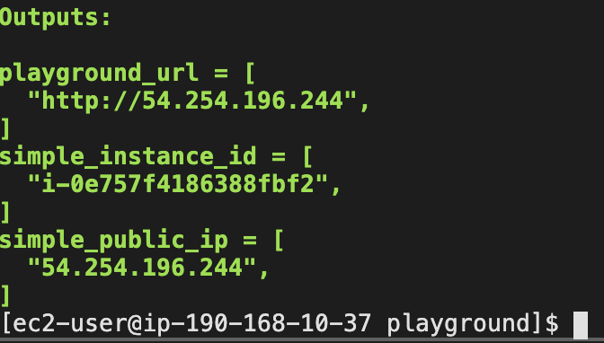

4. Typing `terraform output` will also show the updated output.
    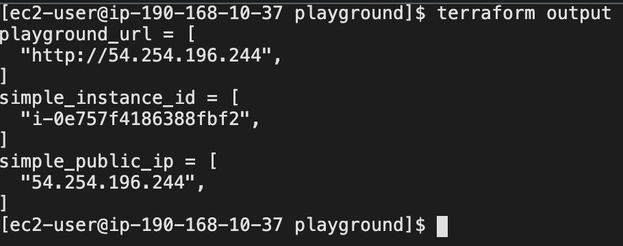

### Updating existing infrastructures with a tfvars file

On top of defining values for terraform variables by providing default values, a `terraform.tfvars` file can also be used.

1. Create a new file called `terraform.tfvars` and type `simple_instance_count_var = "2"`.

    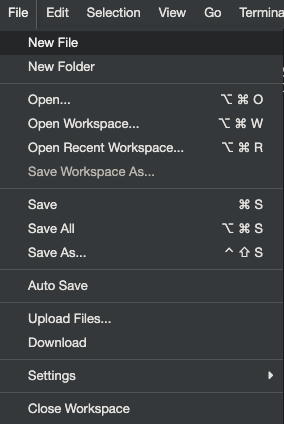

2. Update the `hello.py` file to return a different output instead of hello world, for e.g. `I am Here!`.

    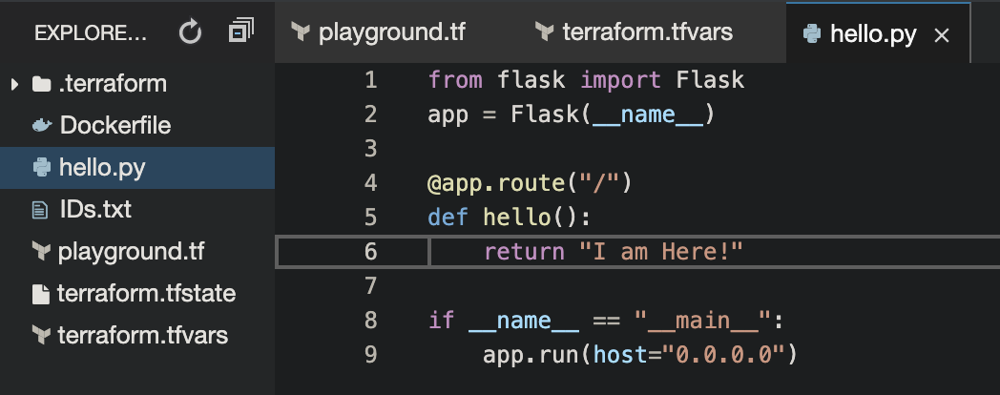

3. Run a `terraform apply` and there should be a prompt to add a resource; in this case an aws_instance resource. Type `yes`

    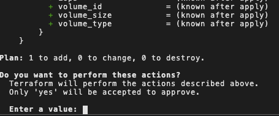
4. Once complete, there are now 2 outputs being returned instead of one.

    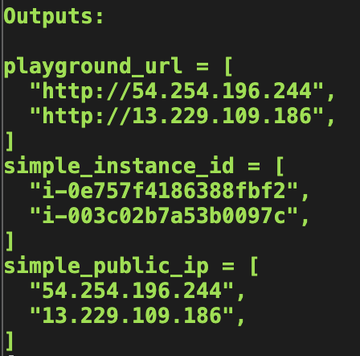
5. Likewise if the `simple_instance_count_var` is changed back to 1 and a terraform apply is run, there will be a prompt to destroy the additional resource.

    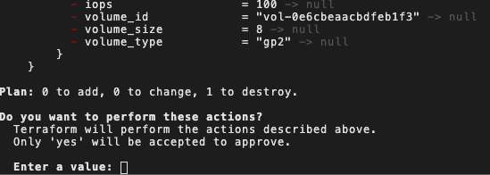

6. When you access the new IP addresses provided, you will see the new web output

    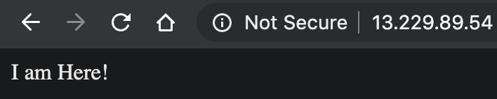

### Taking down the terraform infrastructure

1. To take down the entire infrastructure, run a `terraform destroy`.
    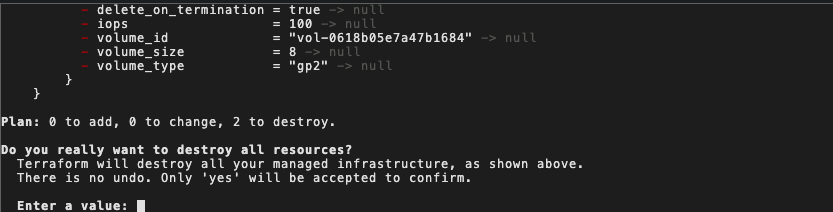

2. Once done the CLI should return the following.
    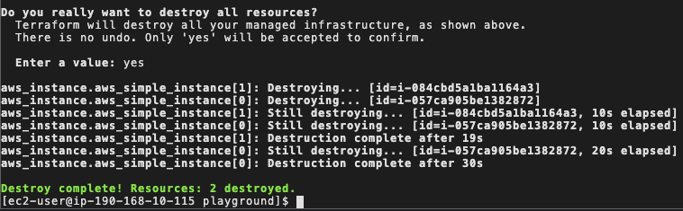

# Conclusion

In this playground, we've shown how to set up an AWS infrastructure using Terraform, using the commands `plan` and `apply` as well how to update an existing infrastructure using `refresh`. Finally, we've also gone through how to take everything down using `destroy`.

At any time, one can simply type `terraform` into the CLI and a list of commands will be displayed, including the ones used today.

# Terraform Training

If you would like to further your knowledge with Terraform or the Hashicorp's product suite. Consider booking a training course with one of ECS Digital's trainers.

For more information check out the link below:

https://ecs-digital.co.uk/what-we-do/training

# Resources

### Hashicorp Terraform

Product Details
https://www.terraform.io/

Documentation
https://www.terraform.io/docs/index.html


# Appendix

### Setting up the Playground Environment

Ensure you have the latest version of terraform installed.

Set the following environment variables:

```
$export AWS_ACCESS_KEY_ID=<YOUR KEY ID>
$export AWS_SECRET_ACCESS_KEY=<YOUR ACCESS KEY>
```

Under modules/aws_iam_user_policy, change the <ACCOUNT_ID> in playground.json

```
"Effect": "Allow",
"Action":"ec2:RunInstances",
"Resource": [
    "arn:aws:ec2:ap-southeast-1:<ACCOUNT_ID>:network-interface/*",
    "arn:aws:ec2:ap-southeast-1:<ACCOUNT_ID>:volume/*",
    "arn:aws:ec2:ap-southeast-1:<ACCOUNT_ID>:key-pair/*",
    "arn:aws:ec2:ap-southeast-1:<ACCOUNT_ID>:security-group/*",
    "arn:aws:ec2:ap-southeast-1:<ACCOUNT_ID>:subnet/*"
]
```

Navigate to the _setup directory and execute:

```
$terraform init
```

Then execute:
```
$terraform plan
```

Finally, apply the plan:

```
$terraform apply
```


### Tearing down the Playground Environment

Navigate to the _setup directory and execute:

```
$terraform destroy
```